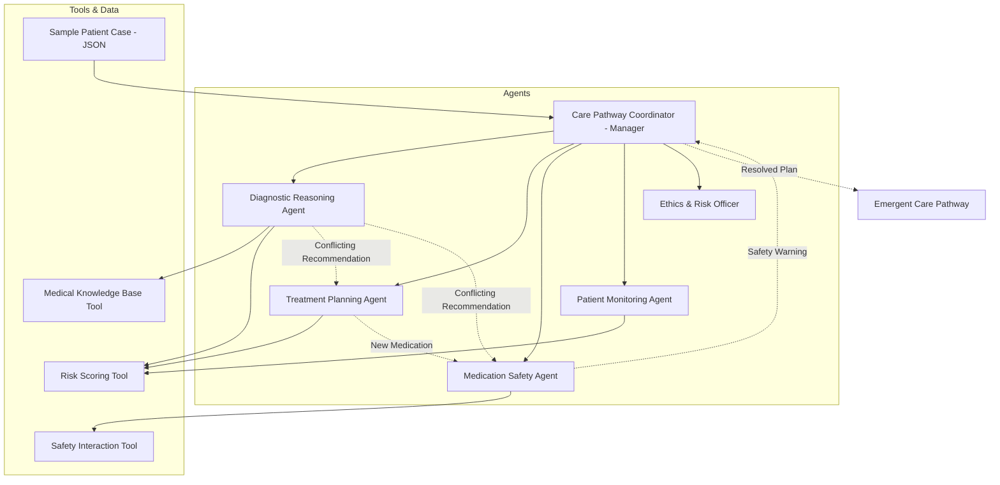

# Architecture: Clinical Decision Support Simulation System (CDSS-MAS)

## System Overview
The CDSS-MAS is a hierarchical Multi-Agent System designed to simulate complex clinical decision-making. It leverages CrewAI for agent orchestration and Streamlit for visualization.

## Architecture Diagram (Mermaid)

## Agent Interaction Flow
1. **Coordination Initiated**: The Manager Agent (Coordinator) receives the patient case.
2. **Distributed Analysis**:
   - **Diagnostic Reasoning Agent** evaluates symptoms to produce hypotheses.
   - **Treatment Planning Agent** proposes guideline-based options.
3. **Reactive Safety Audit**: 
   - **Medication Safety Agent** reacts to proposed treatments using safety tools.
4. **Dynamic Feedback**:
   - **Patient Monitoring Agent** simulates temporal responses.
5. **Normative Evaluation**:
   - **Ethics Agent** applies ethical constraints and burden assessment.
6. **Consensus & Emergence**:
   - The **Coordinator** resolves conflicts (e.g., safety vs. efficacy) and synthesizes the final Pathway.

## Task Dependencies
- `diagnostic_task` (None)
- `treatment_planning_task` (None)
- `safety_audit_task` (treatment_planning_task)
- `monitoring_simulation_task` (treatment_planning_task, diagnostic_task)
- `ethical_review_task` (coordination_task)
- `coordination_task` (All specialists)
